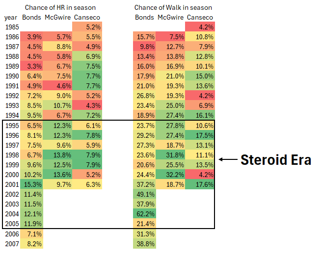
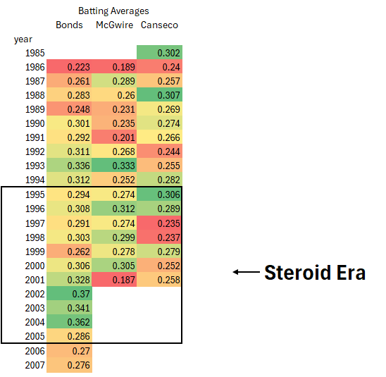
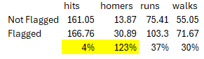
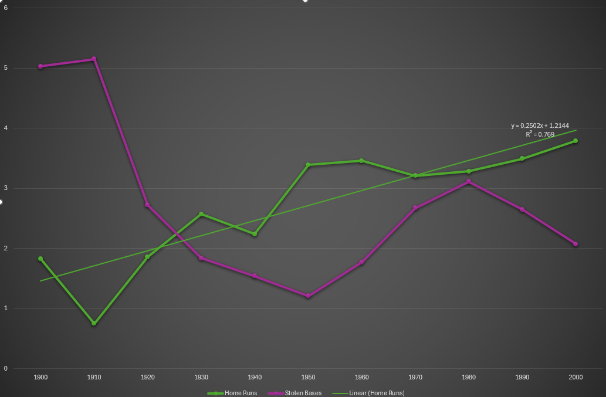
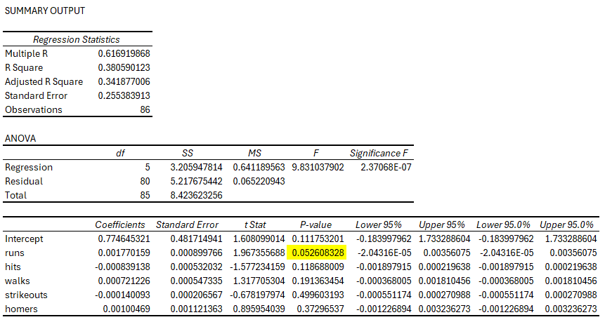

# Baseball_2025
Updated/other skills

# Data cleaning 

This data set contains many data points we do not want or need, such as different leagues. Since baseball is a sport where players are getting traded all the time, much of the data needs to be grouped by player and year to get an accurate representation of the season as a whole. Ive also taken the liberty of limiting results to the years 1920-2025. This data cleaning brought our unique rows from 128,598 to 90,972
<details>
  <summary>Code</summary>
 
  ```sql
with e1 as(
SELECT 
	playerID,
    yearid,
    sum(g)	as g,
    sum(ab)	as ab,
    sum(r)	as r,
    sum(h)	as h,
    sum(2b)	as 2b,
    sum(3b)	as 3b,
    sum(hr)	as hr,
    sum(rbi) as rbi,
    sum(sb)	as sb,
    sum(cs)	as cs,
    sum(bb)	as bb,
    sum(so)	as so,
    sum(ibb)	as ibb,
    sum(hbp)	as hbp,
    sum(sh)	as sh,
    sum(sf)	as sf,
    sum(gidp)	as gidp
FROM baseball_2025.batting
where lgid in ('NL', 'AL') and yearid > 1920
group by playerid, yearID)

select count(distinct playerID)
from e1 
where playerid not in (select playerid from pitching)
```
</details>


# Batters vs Pitchers 


Pitchers were eliminated from the batting dataset to guarantee a clear comparison between position players and pitchers. This keeps pitchers with few offensive appearances from exaggerating the distribution of physical attributes and batter counts. Pitchers and hitters are therefore viewed as mutually exclusive roles. 

Key Findings
- Pitchers are slightly taller and heavier(on avg), as it increases ball speed
- More batters batting left compared to throwing (better pitcher matchup)
- ~9.0K pitchers vs ~7.7K batters Reflects higher pitcher turnover and shorter careers


# ⚾💪Bring Steroids Back💪⚾ 

I've always LOVED baseball, not only because I played it but also because of the stories and the memories I created. The "Steroid Era" is one of the most interesting and controversial eras in sports history. Hearing my dad speak about Mark McGwire and Jose Canseco makes me think how much the game has changed. This era shaped modern baseball analytics, league policy, and how we think about performance today. For these reasons, it deserves to be examined, remembered, and understood.

## 🐐💥⚾The GOATS🐐💥⚾



(HR/AB per season and Walk/AB per season = %)

This heatmap tracks the season-by-season chances of a home run and a walk for three of the most iconic POWER HITTERS of the era. As the timeline moves into the “Steroid Era,” we see a clear shift in all three of these players' stats. There are many factors to take into account, as previously mentioned, but we can see a NOTICABLE change starting from the 1993 season forward. I chose these players not only because of their notoriety during the steroid era, but also because they were figures to me.

Examining players' hitting history shows that there are no other notable features; hitters did not improve their odds of putting the ball in play (hits - homers).  The data shows that these three players had an increase in their HR odds, followed by an increase in walks odds. Being a baseball player myself i think pitchers were seeing an increase in HR and decided that a free base was an easier option. As to what the reason was for the increase in odds of HR.......



Batting Averages also didn't improve much for these players, given their careers. What these players did get was more power, and people knew.

### Flagged Players season 
This comparison aggregates offensive production across all qualifying seasons, meaning players with more playing time and at-bats naturally have a greater influence on the results. Even accounting for this, players flagged for PED use show a clear increase in offensive performance relative to non-flagged players.


 </details>

<details>
  <summary>Code</summary>
	
``` sql
SELECT 
    case 
    when sf.player_id is null then 'Not Flagged' else 'Flagged' end as str_user,
    round(avg(h),2)		as hits,
    round(avg(hr),2)	as homers,
    round(avg(rbi),2)	as runs_batter,
    round(avg(bb),2)	as walks
FROM baseball.batting bb
left join steroid_flag sf
on bb.player_id = sf.player_id
where ab > 500
group by str_user
```
  </details>
While differences in playing time and at-bats contribute to these results, flagged players show a notably larger increase in power-related metrics, particularly home runs. I used a filter of 500 at-bats, which is on par with most full-time players 


# 🏟️Baseball through the Years🏟️ 
### What does the average season look like in each era
I grouped batting seasons into decade-based eras (1910s–2000s) and calculated average offensive output per era, including at-bats, hits, home runs, RBIs, stolen bases, and walks. This approach provides a high-level view of how offensive production and style of play evolved, highlighting the long-term rise in home run hitting relative to earlier eras.


Based on this trendline, average home run output increases by roughly 2–3 home runs per decade over the time period shown. This is just for visualization. No other attributes were taken into consideration, like rule changes, advancements in tech, or any other changes to the game.

<details>
  <summary>Code</summary>
	
``` sql
with e1 as (
SELECT 
	*,
    case 
		when year between '1910' and '1919' then 10
        when year between '1920' and '1929' then 20
        when year between '1930' and '1939' then 30
        when year between '1940' and '1949' then 40
		when year between '1950' and '1959' then 50
        when year between '1960' and '1969' then 60
        when year between '1970' and '1979' then 70
        when year between '1980' and '1989' then 80
        when year between '1990' and '1999' then 90
        when year between '2000' and '2010' then 01
        else 0 end as era
FROM baseball.batting)

select 
	era, 
    round(avg(ab),2)		as at_bat,
    round(avg(h),2)			as hits,
    round(avg(hr),2)		as homers,
    round(avg(rbi),2)		as run_bat_in,
    round(avg(sb),2)		as stole,
    round(avg(bb),2)		as walk
from e1 
group by era
```
 

# Team Regression 
To explore the relationship between offensive production and team success, I ran a linear regression using historical team-level baseball data. The goal was to identify which offensive statistics are most closely associated with winning across full seasons.

Key Findings 
- Runs scored are the strongest predictor of team success
Across all models, runs scored had a highly significant positive relationship with winning percentage.
- Hits alone do not drive wins Once run production was included, hits showed a small but statistically significant negative relationship with winning. This suggests that raw hit totals are less important than how efficiently those hits translate into runs.
  


<details>
  <summary>SQL Code</summary>
 
  ```sql
SELECT
	year,
    w		as wins,
    l		as loss,
    round((w/l),2) as ratio,
	ab		as at_bat,
    r		as runs,	
    h		as hits,
    hr		as homeruns,
    era		as era,
    BB		as walks,
	SO		as strikeouts
    FROM baseball.team
where name like '%%dodgers%%'
```
</details>

